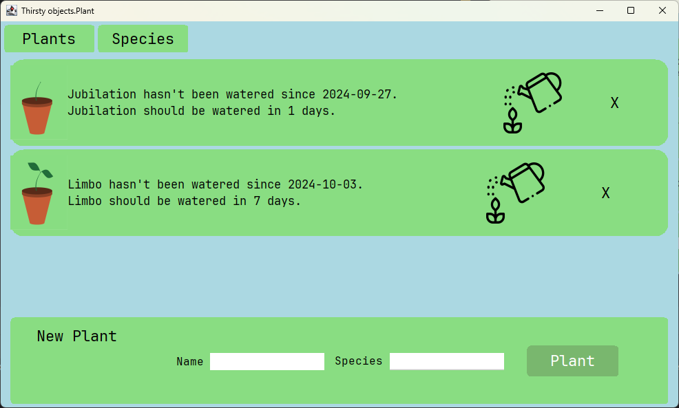

# Thirsty Plant 2

## Overview

A houseplant care app developed by Owen Graham using Java. The app allows users to enter information about their houseplants, such as name and species, and record when they water them. The app integrates with the [Penenual plant API](https://perenual.com/docs/api) to retrieve data about the species of the user's houseplants so that the app can tell users how soon they need to water them.

> Note: This app is a work in progress

## Contents

<!-- TOC -->
* [Thirsty Plant 2](#thirsty-plant-2)
  * [Overview](#overview)
  * [Contents](#contents)
  * [Technologies Used](#technologies-used)
  * [User Guide](#user-guide)
    * [Prerequisites](#prerequisites)
    * [Setup](#setup)
    * [Running the Application](#running-the-application)
<!-- TOC -->

## Technologies Used

- **Java**: Core language used to develop the application.
- **Java** Swing: Utilized for creating the graphical user interface (GUI) of the app, providing a platform-independent way to implement the UI.
- **Maven**: Build automation tool used for dependency management and project structure.
- **Jackson**: Library used for parsing and deserializing JSON data retrieved from external sources.
- **Perenual Plant API**: Third-party API used to obtain detailed information about plant species, enabling the app to recommend optimal watering schedules for different plants.

## Features

- Add and Manage Houseplants

&nbsp;&nbsp;&nbsp;&nbsp;Users can enter and store information about their houseplants, including the plant's name and species.

- Watering Schedule Tracker

&nbsp;&nbsp;&nbsp;&nbsp;Keep track of when each plant was last watered, with automatic reminders for when it's time to water them again based on species-specific needs.

- Species Information Retrieval

&nbsp;&nbsp;&nbsp;&nbsp;The app integrates with the Perenual Plant API to retrieve detailed species data, providing users with information on optimal watering frequency and other care recommendations.

- Dynamic Watering Recommendations

&nbsp;&nbsp;&nbsp;&nbsp;Using species data from the Perenual Plant API, the app calculates personalized watering schedules and notifies users when each plant requires attention.

- User-Friendly Interface

&nbsp;&nbsp;&nbsp;&nbsp;A simple, intuitive UI built with Java Swing makes it easy to navigate through the app, add new plants, and view plant details.

- Data Persistence

&nbsp;&nbsp;&nbsp;&nbsp;The app stores plant information and watering history locally, allowing users to access their data even after restarting the application.

## User Guide

### Prerequisites

- [Maven](https://maven.apache.org/download.cgi)
- [JDK 22](https://www.oracle.com/java/technologies/javase/jdk22-archive-downloads.html)
- [Perenual API key](https://perenual.com/docs/api)

### Setup

_The following instructions are for Windows machines_

1. Clone the git repository: `git clone https://github.com/OwenGraham/Thirsty-Plant-2.git`

Follow these steps to get access to the integrated [Penenual plant API](https://perenual.com/docs/api)

1. Create an account on [perenual.com](https://perenual.com/)
2. Generate an API key by going to the [API documentation page](https://perenual.com/docs/api), clicking `GET API KEY AND ACCESS`, logging in if prompted, and clicking the `Generate New Key` button the page that open.
3. Open a terminal and navigate to the repository root
4. Run the following command to create a properties file containing your API key: `echo api.key=YOUR.API.KEY > src/main/resources/config.properties`

> Make sure to replace "YOUR.API.KEY" with the key you generated on perenual.com

### Running the Application

1. Open a terminal and navigate to the repository root
2. Run the following command to build the project into a Jar file with Maven: `mvn clean package`
3. Start the app by running `java -cp ".\target\classes;target/lib/*" app.App`

## UI Design

A wireframe of the app's UI was created using Figma:

